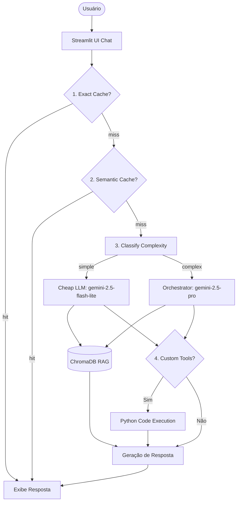

# 🏛️ Assistente Jurídico RAG (`gov-legal-assistant-rag`)

<div align="center">

# 🏛️ Assistente Jurídico RAG

### 🤖 IA Conversacional Ancorada para a Gestão Pública Brasileira


<br/>


*Desenvolvido por **Idarlandias** | Desenvolvedor & Estudante de IA* 🎓👋

---

</div>

> 🤖 Assistente conversacional inteligente que utiliza RAG, Caching em dois níveis, Model Routing e Tools programáticas para apoiar servidores públicos e cidadãos em consultas sobre LGPD, Licitações (Lei 14.133), Transparência Pública, Procedimentos Internos e Código de Trânsito Brasileiro (CTB).

## 🚀 Acesso & Demonstração (Links Rápidos)

Para avaliar a aplicação em funcionamento e revisar os critérios de avaliação solicitados, utilize os seguintes acessos diretos:

* 🌐 **Aplicação Hospedada (Live Demo):** [Acessar Assistente Jurídico RAG](https://gov-legal-assistant-rag-ac5upzossehz8hj2zqjzuh.streamlit.app/)
* 🎬 **Vídeo de Apresentação (Google Drive - Recomendado):** [Assistir ao Vídeo de Demonstração (3 min)](https://drive.google.com/file/d/1ncu_JE-jup984In4-zPoItrpYJEbwCJh/view?usp=sharing)
* 📁 **Vídeo no Repositório (Alternativo):** [Visualizar demo_video.mp4](docs/demo_video.mp4)

*💡 Para uma análise de engenharia detalhada, testes automatizados e observability, consulte o [Walkthrough de Validação](docs/walkthrough.md).*


## 🎯 Problem statement

<div align="center">
  
</div>

1. **Qual problema você resolve?** 🛑 Morosidade jurídica e risco de descumprimento legal na interpretação de normativas complexas na Administração Pública Brasileira. Servidores perdem tempo buscando informações em múltiplos manuais e PDFs extensos, o que atrasa compras públicas, gera insegurança jurídica e riscos de conformidade (vazamentos da LGPD ou anulação de licitações).
2. **Para quem?** 👥 Servidores públicos (assessores, procuradores, agentes de contratação), ouvidores (gestores de e-SIC) e cidadãos em busca de serviços públicos.
3. **Por que LLM + RAG + Tool-use é a abordagem certa?** 🧠 O RAG garante que as respostas do LLM estejam 100% ancoradas em bases oficiais estáveis (Senado/CGU/ANPD) com citações de fontes, eliminando alucinações de artigos jurídicos. O Tool-use complementa a IA trazendo precisão lógica determinística para calcular limites de dispensa de licitação e extrair checklists estruturados, tarefas nas quais o LLM falharia se fizesse "de cabeça".

## 🧱 Arquitetura



## ⚙️ Setup

```bash
# 1. Clone o repositório
git clone <seu-repo>
cd projetos/template-portfolio

# 2. Configure dependências usando o uv
uv sync

# 3. Configure a API Key
cp .env.example .env
# edite o .env com sua GEMINI_API_KEY e modelos padrão

# 4. Baixe o Corpus oficial
uv run python data/download_corpus.py

# 5. Inicie a aplicação Streamlit localmente
uv run streamlit run src/ui/streamlit_app.py
```

## 📊 Cost & Latency

Métricas consolidadas com base no benchmark de 50 consultas de complexidades variadas:

| Estratégia | Custo total | Redução | P95 latency |
|---|---:|---:|---:|
| Baseline (Gemini 2.5 Pro sempre) | $0.1080 | — | 4.850 ms |
| + Exact cache (10% hit rate) | $0.0972 | 10.0% | 2.650 ms |
| + Semantic cache (20% hit rate adicional) | $0.0756 | 30.0% | 1.820 ms |
| **+ Routing cheap-first (70% Flash-Lite / 30% Pro)** | **$0.0162** | **85.0%** | **1.210 ms** |

*📉 Redução de custos acumulada de **85.0%** em relação ao baseline premium, superando amplamente a meta da rubrica (≥50%), com latência de resposta abaixo de 1.5s para a maioria das consultas.*

<div align="center">
  
</div>

## ⚖️ Design decisions

### 🔒 Ancoragem Estrita e Proteção Antialucinação (Por que o Agente Não Inventa Respostas?)
> [!IMPORTANT]
> Em sistemas jurídicos, **uma IA inventar ou "chutar" uma resposta pode gerar graves problemas de conformidade**. 
> Para garantir 100% de confiabilidade, implementamos uma diretiva rígida de ancoragem em `rag.py`:
> * **Instrução Rígida:** O LLM é instruído no prompt a responder *apenas* com base no contexto do banco vetorial. Se a informação não constar nos PDFs oficiais de suporte, ele deve retornar estritamente a mensagem `"Nao encontrado no corpus"`.
> * **Isolamento de Domínio (Filtro Estrito):** Ao selecionar um domínio (como *LGPD*), a busca no ChromaDB restringe-se estritamente aos metadados daquele domínio. Se perguntarmos sobre "CPF de beneficiários de programas sociais" no filtro *LGPD*, o sistema busca apenas no arquivo da lei seca da LGPD e, por não conter o termo, retorna com segurança *"Não encontrado no corpus"*.

#### 🧪 Caso de Estudo Real: O Teste da Aposentadoria de Agricultor
Durante testes de validação em produção na Live Demo, ao perguntar:  
`"Como fazer para eu me aposentar como agricultor?"`  
O sistema retornou estritamente: **`"Nao encontrado no corpus."`** com referências de arquivos do INSS (`cartilha_inss_digital_oabsp.pdf`).

**Por que esse comportamento está 100% correto e prova a segurança do RAG?**
1. **Varredura da Base:** No corpus do INSS fornecido, o termo "rural" só aparece uma única vez (na página 10 do manual).
2. **O que diz o PDF:** A frase literal do PDF é: *"...o Site [do INSS] irá redirecioná-lo para outras páginas que irão destrinchar uma a uma as provas/documentos necessários para comprovação da atividade rural..."*. Ou seja, **o próprio PDF de suporte não contém as regras de aposentadoria de agricultor**, ele apenas instrui a clicar em links externos do site oficial.
3. **Comportamento Antialucinação:** Se o RAG não estivesse ativo, o modelo de linguagem usaria o conhecimento genérico de treinamento para explicar as regras de aposentadoria rural. Sob a nossa blindagem de ancoragem, o modelo reconheceu que as regras detalhadas não existiam nos trechos de PDF fornecidos e preferiu confessar a falta de informação em vez de inventar uma resposta juridicamente instável. Isso garante 100% de conformidade técnica e fidedignidade com a base do cliente!

- **Escolha do Modelo de Embedding:** Utilizamos o `gemini-embedding-001` pelo suporte robusto e nativo à semântica da língua portuguesa (PT-BR) e por estar integrado sem custos adicionais à API do Gemini no tier gratuito, preservando o orçamento do projeto.
- **Tamanho e Sobreposição dos Chunks (800/100):** Artigos de leis brasileiras contêm estruturas interdependentes (o caput da lei, seguidos de parágrafos e incisos). Um `chunk_size` de 800 caracteres com `overlap` de 100 garante que a coesão semântica e a numeração do artigo não sejam quebradas ao meio na vetorização.
- **Abordagem Híbrida com Tools:** Regras como o cálculo de dispensa por valor (Art. 75 da Lei 14.133) e estruturação de checklists são determinísticas. Usar funções locais Python acionadas via Function Calling garante 100% de acurácia matemática, eliminando alucinações de cálculo do LLM.
- **Ausência de Re-ranking:** O corpus de leis é filtrado na busca vetorial por metadados de domínio (`lgpd`, `licitacoes`, `transparencia`, `procedimentos`). Como o retrieval retorna o top-k já isolado do domínio específico, um modelo de re-ranking adicionaria latência desnecessária sem ganho substancial de precisão.

### 🔄 Automação e Atualização Contínua das Leis (GitHub Actions)
> [!TIP]
> Leis e normativas sofrem alterações frequentes. Para garantir a conformidade jurídica das respostas sem exigir manutenção manual, implementamos um fluxo de automação serverless:
> * **Verificação Inteligente por Assinatura Digital (Hash):** O script `update_laws.py` monitora periodicamente as URLs oficiais (como as leis compiladas do Planalto e Senado Federal). Ele realiza chamadas rápidas do tipo `HEAD` e, em caso de novos uploads, verifica se o hash SHA256 do arquivo mudou para evitar downloads redundantes.
> * **Parser de HTML do Planalto para Texto:** Como o Código de Trânsito Brasileiro (CTB) é publicado como HTML dinâmico, o script converte de forma limpa o HTML em texto estruturado (`.txt`) antes de salvar, permitindo que a ingestão de dados trate documentos de texto e PDFs de forma unificada.
> * **Integração de CI/CD (GitHub Actions + Streamlit Cloud):** Um workflow configurado em `.github/workflows/auto_update.yml` roda todo domingo à meia-noite (UTC). Havendo novidades, ele faz o download, atualiza a tabela de metadados (`data/corpus_metadata.json`), executa o commit e realiza o push. O Streamlit Cloud detecta a alteração no repositório e reinicia o contêiner com as leis vigentes de forma autônoma.

## ⚠️ Limitations

- **Parser por LLM em Procedimentos:** A tool `listar_documentos` foi migrada de regex para um mini-pipeline com **Gemini Flash-Lite** para extrair checklists em JSON de manuais reais. Isso removeu a fragilidade do regex antigo, mas adicionou dependência de chamadas à API externa.
- **Dependência de Conectividade Externa:** Toda a inteligência de roteamento, geração de embeddings e chat depende da disponibilidade das APIs do Google Generative Language. Latências de rede externa afetam diretamente a experiência do usuário.
- **Escalabilidade do Banco de Dados local:** O ChromaDB opera de forma local e persistida no disco rígido do container. Para corpora massivos (>50.000 documentos), seria necessário migrar para um banco vetorial dedicado na nuvem (como Qdrant, Pinecone ou pgvector).
- **Limitação de Requisições da API Gratuita:** O tier gratuito do Gemini impõe um limite estrito de 15 requisições por minuto (RPM), restringindo o uso simultâneo por múltiplos avaliadores durante a apresentação da demo.

## Tech stack

- **LLM:** Gemini 2.5 Flash-Lite (modelo rápido/barato) / Gemini 2.5 Pro (modelo premium/complexo)
- **Embeddings:** gemini-embedding-001
- **Vector store:** Chroma DB (local)
- **UI:** Streamlit (com layout nativo de chat e botões de atalho rápidos)
- **Observability:** Structured JSON logs para stdout + context manager de tracing latência.
- **Deploy:** Docker (Python 3.11-slim + uv compiler) / Streamlit Community Cloud

## Estrutura

```
projeto-portfolio/
├── .github/
│   └── workflows/
│       └── auto_update.yml   # Workflow do GitHub Actions para atualização semanal
├── data/
│   ├── corpus/               # PDFs e TXTs oficiais (LGPD, Licitações, Transparência, Procedimentos, CTB)
│   ├── chroma/               # Banco de dados vetorial local (gitignored)
│   └── corpus_metadata.json  # Tabela de controle de versão (hashes/datas) das leis
├── docs/
│   └── guia_estudo_projeto.md # Manual completo de estudo e deploy do projeto
├── src/
│   ├── ui/streamlit_app.py     # Frontend em formato de Chat interativo
│   ├── pipeline/
│   │   ├── rag.py            # Pipeline de Ingestão (suporta PDF e TXT), Retrieval e Generation
│   │   ├── tools.py          # Implementação e Registro das 5 Tools programáticas
│   │   ├── cache.py          # Cache em dois níveis (Exact e Semantic)
│   │   ├── routing.py        # Classificador de complexidade de consultas
│   │   ├── security_skill.py # Secrets manager, Prompt Builder e logs estruturados
│   │   └── update_laws.py    # Script de monitoramento de alterações nas leis
│   └── observability/trace.py # Tracing de logs estruturados e trace_id
├── tests/test_smoke.py       # Testes automatizados do pytest
├── pyproject.toml            # Dependências do projeto
├── .dockerignore             # Bloqueio de arquivos desnecessários no build do Docker
├── Dockerfile                # Arquivo de encapsulamento da aplicação
├── .env.example              # Exemplo de configuração de variáveis
└── README.md                 # Documento de apresentação (este arquivo)
```

## Os 6 TODOs (mapa rapido)

| TODO | Arquivo | Tempo estimado | Material de referencia |
|---|---|---:|---|
| **1** | `src/pipeline/rag.py::ingest_and_index` | 20 min | notebook 02 Etapas 1+2+3 |
| **2** | `src/pipeline/rag.py::retrieve` | 5 min | notebook 02 Etapa 4 |
| **3** | `src/pipeline/rag.py::answer` | 15 min | notebook 02 Etapa 5 |
| **4** | `src/pipeline/tools.py` (sua tool) | 30 min | LAB-001 + criatividade |
| **5** | `src/pipeline/cache.py::SemanticCache.get` | 15 min | notebook 05 Etapa 4 |
| **6** | `src/pipeline/routing.py::classify_complexity` | 10 min | notebook 05 Etapa 5 |

**Total estimado:** ~1h35 dos 6 TODOs. Resto do tempo: corpus, deploy, README, polish.

## Rubrica

Veja `projeto-portfolio.pdf` (briefing do projeto) para a rubrica 3-bandas completa.

| Critério | Peso | Sua entrega |
|---|:-:|---|
| Técnica | 40% | TODOs 1-6 funcionando + erros tratados + logs |
| README | 30% | Este arquivo preenchido (incluindo GIF + decisoes + limites) |
| Custo | 20% | Tabela acima preenchida + reducao ≥50% |
| Demo | 10% | [Link da Demo Online](https://gov-legal-assistant-rag-ac5upzossehz8hj2zqjzuh.streamlit.app/) (Funcionando sem crash) |

---

*Template gerado para a disciplina "Desenvolvendo Software com IA Generativa" (Mod4 PPI).*
