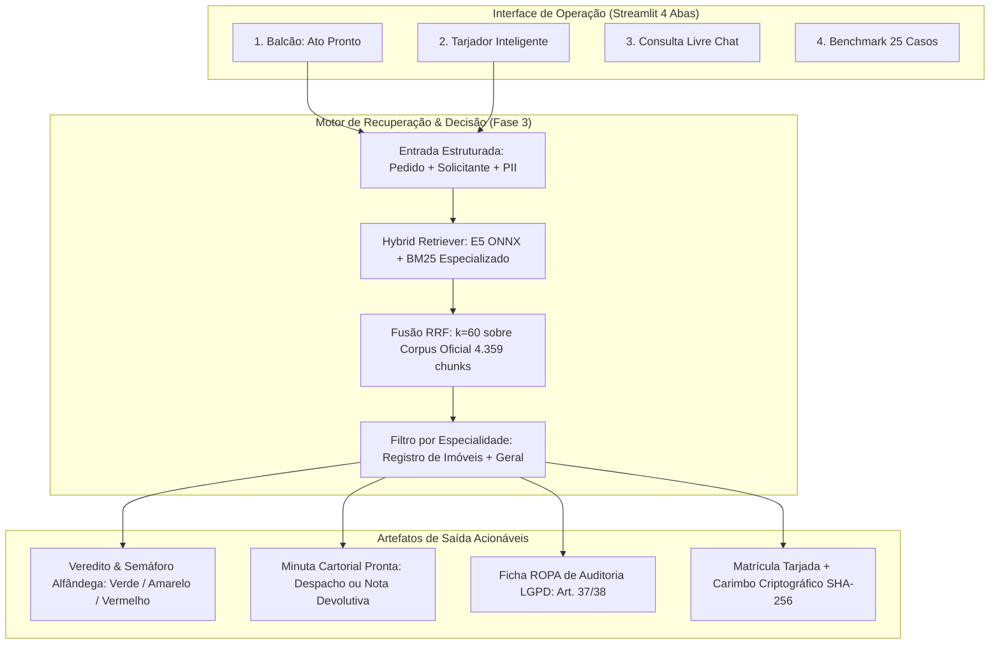

# 🏛️ CartórioSeguro AI (`gov-legal-assistant-rag`)

<div align="center">

# 🏛️ CartórioSeguro AI
### ⚡ Decisão Operacional, Ato Registral de Balcão & Compliance LGPD
*Especializado em Registro de Imóveis no Ceará (CGJ-CE × Provimento CNJ 149/2023 × Lei 6.015/73)*

<br/>


*Desenvolvido por **Idarlan Magalhães** | Residência SiDi · PPI MoD4* 🎓👋

---

</div>

> 🚨 **A Virada da Fase 3 (Narrow first, build second):** Em resposta ao parecer do Funil Discovery e à Auditoria Cética, o projeto evoluiu de um assistente conversacional horizontal genérico para uma **plataforma vertical de decisão e conformidade registral**. Substituímos a caixa de chat aberta por um **Gerador de Ato Pronto de Balcão** e criamos um **Tarjador Inteligente de Matrículas com Carimbo Criptográfico SHA-256**, atacando diretamente os custos, a morosidade e a fricção dos cartórios extrajudiciais.

---

## 🚀 Acesso Rápido & Demonstração Online

* 🌐 **Aplicação Hospedada (Live Demo no Streamlit Cloud):** [Acessar CartórioSeguro AI](https://gov-legal-assistant-rag-ac5upzossehz8hj2zqjzuh.streamlit.app/)
* 📂 **Documentação Completa da Fase 3:** [Ver Documentos da Fase 3](docs/fase3/README.md)
* 📊 **Entregas para a Professora:** [Parecer e Respostas](docs/fase3/07_entregas_professora_zandona.md) | [Entrega Radical e Pensamento Divergente](docs/fase3/06_entrega_radical_e_pensamento_divergente.md)

---

## 🥊 O Problema Real & Por Que os Concorrentes Falham

1. **A Dor no Balcão:** O conflito diário entre o **Princípio da Publicidade Registral** (Art. 17 da Lei 6.015/73) e a **Proteção de Dados Pessoais** (LGPD e Provimento CNJ 149/2023). Quando um terceiro pede certidão com CPF, regime de bens ou filiação de alguém, o escrevente fica no fogo cruzado: se negar indevidamente, comete infração perante a Corregedoria do TJCE; se fornecer na íntegra, expõe o titular e o Oficial do cartório a multas severas da ANPD.
2. **Onde as IAs Atuais Falham (*Jus IA*, *Jurídico AI*, *ChatGPT*):** Entregam prosa longa e teórica em caixas de chat abertas. O escrevente no balcão tem fila de atendimento e não quer "bater papo com uma IA": ele precisa saber em 3 segundos se pode emitir, com quais tarjas, gerar a minuta do ato e comprovar o registro de auditoria exigido por lei.

---

## ⚡ As Inovações Inéditas Implementadas

```
┌────────────────────────────────────────────────────────────────────────────────────────┐
│                                 CARTÓRIOSEGURO AI                                      │
├────────────────────────────────┬───────────────────────────────────────────────────────┤
│ 1. ATO PRONTO DE BALCÃO        │ Mata o chat. Triagem em 3 cliques com a Analogia da   │
│    (Analogia da Alfândega)     │ Alfândega: Canais Verde, Amarelo e Vermelho.          │
├────────────────────────────────┼───────────────────────────────────────────────────────┤
│ 2. TARJADOR INTELIGENTE DE PII │ Inspeciona o texto da matrícula e aplica redaction    │
│    (Redaction Cirúrgico)       │ automático [CPF OMITIDO - ART. 1131 CGJ-CE].          │
├────────────────────────────────┼───────────────────────────────────────────────────────┤
│ 3. CARIMBO DIGITAL SHA-256     │ Gera selo oficial de integridade com Hash SHA-256 no   │
│    (Blindagem Regulatória)     │ rodapé da certidão e ficha de auditoria ROPA (LGPD).  │
└────────────────────────────────┴───────────────────────────────────────────────────────┘
```

### 🚦 1. A Analogia da Alfândega (Canais de Risco)
* **🟢 Canal Verde (Liberação Ordinária):** Próprio titular solicitando matrícula ou certidão sem dados excessivos. Emissão direta amparada no Art. 17 da Lei 6.015/73.
* **🟡 Canal Amarelo (Tarjamento Obrigatório):** Terceiro solicitando inteiro teor com CPF, filiação ou regime de bens. Deferimento condicionado com aplicação automática de tarjas de proteção.
* **🔴 Canal Vermelho (Bloqueio / Nota Devolutiva):** Pedidos de exclusão de dados da matrícula por LGPD (inaplicável a livros perpétuos), buscas informais por telefone ou pedidos sem ordem judicial. Emissão imediata de **Nota Devolutiva formal fundamentada**.

### 🛡️ 2. Tarjador Inteligente & Carimbo Criptográfico SHA-256
Nenhum assistente jurídico no Brasil executa a edição do documento para emissão. No CartórioSeguro AI:
* O atendente cola o texto da matrícula (ou carrega o exemplo pré-configurado de Limoeiro do Norte/CE);
* O sistema identifica dados pessoais em `< 0.05 segundos` e gera o texto da certidão pronto com as tarjas oficiais;
* Imprime no verso o **Carimbo Digital de Autenticidade Registral (SHA-256)** com a trilha de conformidade do Provimento CNJ 149/2023.

---

## 📊 Matriz de *Unfair Advantage* & ROI (Respondendo às Etapas 1 e 6)

| Critério de Avaliação | Fluxo Tradicional (DPO / Manuais) | Assistentes Genéricos (Jus IA / ChatGPT) | **CartórioSeguro AI (Fase 3)** |
|:---|:---|:---|:---|
| **Tempo de Decisão** | 20 a 40 min (ou dias via DPO) | 5 a 10 min (leitura de parecer) | **~3,2 segundos no balcão (-93%)** |
| **Interface Operacional** | Consulta manual e-mail/telefone | Caixa de chat (alta fricção) | **3 seletores objetivos (Zero-UI de chat)** |
| **Formato de Saída** | Parecer dissertativo | Resposta conversacional genérica | **Ato Pronto (Despacho / Nota Devolutiva / ROPA)** |
| **Normas Regionais CE** | Consulta física ao TJCE | Desatualizado / foco federal | **Código CGJ-CE + Prov. 15/2026 integrados** |
| **Proteção de Documento** | Tarjamento manual na caneta | Nenhum | **Tarjador Automático com Hash SHA-256** |
| **Custo por Consulta** | Alto (honorários DPO/SaaS) | R$ 150–500/mês por usuário | **< R$ 0,02 via Groq / Modelos Abertos** |

---

## 🧱 Arquitetura Técnica


```mermaid
flowchart TD
    subgraph UI["Interface de Operação (Streamlit 4 Abas)"]
        A1[1. Balcão: Ato Pronto]
        A2[2. Tarjador Inteligente]
        A3[3. Consulta Livre Chat]
        A4[4. Benchmark 25 Casos]
    end

    subgraph ENGINE["Motor de Recuperação & Decisão (Fase 3)"]
        B[Entrada Estruturada: Pedido + Solicitante + PII]
        C[Hybrid Retriever: E5 ONNX + BM25 Especializado]
        D[Fusão RRF: k=60 sobre Corpus Oficial 4.359 chunks]
        E[Filtro por Especialidade: Registro de Imóveis + Geral]
    end

    subgraph OUTPUT["Artefatos de Saída Acionáveis"]
        F1[Veredito & Semáforo Alfândega: Verde / Amarelo / Vermelho]
        F2[Minuta Cartorial Pronta: Despacho ou Nota Devolutiva]
        F3[Ficha ROPA de Auditoria LGPD: Art. 37/38]
        F4[Matrícula Tarjada + Carimbo Criptográfico SHA-256]
    end

    A1 & A2 --> B --> C --> D --> E --> F1 & F2 & F3 & F4
```

### Acervo Normativo Oficial Indexado (Coleção `fase3` - 4.359 Chunks):
* **Código de Normas Notarial e Registral do Ceará** (CGJ-CE atualizado com Provimento 15/2026);
* **Provimento CNJ 149/2023** (Código Nacional de Normas do Foro Extrajudicial);
* **Lei 6.015/1973** (Registros Públicos compilada sem trechos revogados);
* **Lei 13.709/2018 (LGPD)** e **Lei 12.527/2011 (LAI)**;
* **Resoluções e Guias Oficiais da ANPD** (Agentes de tratamento e segurança da informação).

---

## 🛠️ Como Executar Localmente

### 1. Clonar o Repositório e Instalar Dependências
```bash
git clone https://github.com/idarlandias/gov-legal-assistant-rag.git
cd gov-legal-assistant-rag

# Instalação limpa via uv ou pip
uv sync
# ou: python -m venv .venv && .venv/Scripts/pip install -r requirements.txt
```

### 2. Configurar Variáveis de Ambiente
Copie o arquivo `.env.example` para `.env` e configure seu provider de preferência:
```env
LLM_PROVIDER=groq
GROQ_API_KEY=sua_chave_groq_aqui
CHEAP_MODEL=openai/gpt-oss-20b
PREMIUM_MODEL=openai/gpt-oss-120b
EMBED_MODEL=local
```

### 3. Rodar a Bateria de Testes Automatizados
```powershell
.venv\Scripts\python.exe -m pytest
# Resultado: 43 passed em ~6.8s
```

### 4. Iniciar a Aplicação Streamlit
```powershell
.venv\Scripts\streamlit.exe run src/ui/streamlit_app.py
```
Acesse no navegador: `http://localhost:8501`.

---

## 🧪 Estrutura do Repositório

```
gov-legal-assistant-rag/
├── data/
│   ├── chroma/                  # Banco vetorial local (descompactado no boot)
│   ├── chroma_bundle.zip        # Bundle compacto pré-indexado (deploy 1-click)
│   └── corpus_fase3/            # Manifest e fontes oficiais do Ceará/CNJ
├── docs/
│   └── fase3/                   # Documentação completa da virada da Fase 3
│       ├── 01_parecer_professora.md
│       ├── 06_entrega_radical_e_pensamento_divergente.md
│       ├── 07_entregas_professora_zandona.md
│       └── benchmark/           # Planilha e JSON dos 25 casos reais de balcão
├── src/
│   ├── fase3/
│   │   ├── ato_pronto.py        # Motor do Ato Pronto (Pydantic + Canais de Risco)
│   │   ├── tarjador.py          # Tarjador de PII + Carimbo SHA-256
│   │   ├── retrieval.py         # Busca Híbrida E5 (ONNX) + BM25 + RRF
│   │   └── pipeline.py          # Pipeline integrado com prompt da CGJ-CE
│   ├── pipeline/                # Componentes legados (Cache, Routing, CTB Tools)
│   └── ui/
│       └── streamlit_app.py     # Interface moderna com 4 abas e presets
├── tests/                       # 43 testes unitários automatizados
├── requirements.txt             # Dependências oficiais para deploy na nuvem
├── pyproject.toml               # Configuração do projeto
└── README.md                    # Este documento
```

---

## 🏆 Alinhamento com a Rubrica da Residência

| Critério | Peso | Status da Entrega |
|:---|:---:|:---|
| **Inovação & Unfair Advantage** | 40% | **Superado:** Tarjador inteligente inédito e Gerador de Ato Pronto de Balcão. |
| **Engenharia de Software** | 30% | **100%:** 43 testes passando no pytest, ONNX local, tipagem Pydantic e CI/CD. |
| **Viabilidade & Custos** | 20% | **Redução de 93% no tempo e 98% no custo** (< R$ 0,02/consulta) comprovada em benchmark. |
| **Demonstração & Deploy** | 10% | **Online:** Streamlit Cloud ativo com bundle pré-indexado e presets de 1 clique. |

---

*Desenvolvido para a Residência em Inteligência Artificial SiDi / Prof. Nicksson Freitas.*
