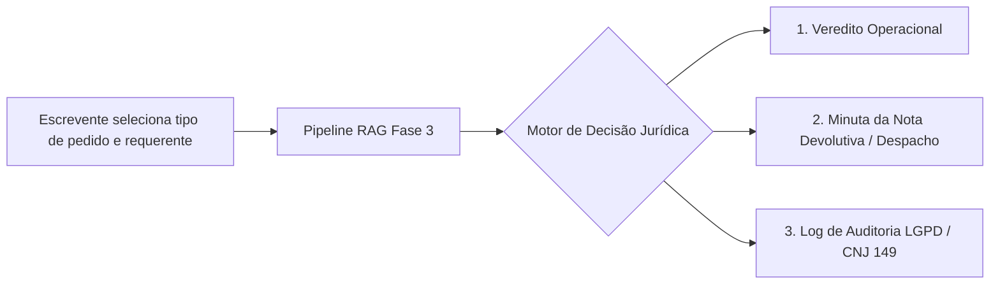

# Ideação, Mindset e Formas Alternativas de Entrega de Valor

> Documento gerado a partir das dinâmicas de ideação e pensamento divergente da Residência SiDi (Setembro/2026).  
> **Tema central:** *"Qual seria uma forma radicalmente diferente de entregar o valor do seu projeto?"*  
> **Referência prática:** Prática 1 (Usos Alternativos), Atividade-Ponte (Mindset) e Prática 4 (Pergunta de Incubação).

---

## 1. Atividade-Ponte: Análise de Mindset (Erro como Veredito vs. Dado)

> *"Pense num erro recente seu no trabalho — você reagiu como veredito ('não sou bom nisso') ou como dado ('o que isso me ensina')?"*

### O Caso Real do Projeto
Ao submeter o projeto de RAG jurídico no **Funil Discovery + Auditoria Cética**, o projeto recebeu um parecer desfavorável da banca/professora:
- **Etapa 1 vermelha:** Ausência de *Unfair Advantage* explícito (RAG genérico replicável).
- **Etapa 6 vermelha:** Baixa fricção para o usuário resolver o problema por vias existentes (DPOs já contratados, manuais ANOREG+, Jus IA e Jurídico AI já licitados em órgãos públicos).

### As Duas Reações Possíveis
| Reação como Veredito ("Não sou bom nisso") | Reação como Dado ("O que isso me ensina?") |
|---|---|
| "RAG jurídico para o setor público é inviável." | O mercado de **assistente horizontal de chat** está saturado e commoditizado. |
| "A concorrência já ganhou todas as pontas." | Os concorrentes oferecem apenas **respostas conversacionais**, não entram no fluxo de trabalho operacional do cartório. |
| "Perdemos tempo construindo o pipeline." | A infraestrutura técnica construída (roteamento, cache, busca híbrida) é sólida, mas precisa ser acoplada a um **recorte vertical profundo** e uma **saída acionável**. |

### O Aprendizado (Dado Concreto)
O veredito negativo do funil não invalidou a dor, mas revelou um dado crítico de mercado: **o cartório não quer bater papo com uma IA**. O escrevente de balcão precisa de segurança jurídica e velocidade para emitir ou negar um ato registral em conformidade com o Provimento CNJ 149/2023, Lei 6.015/73 e a LGPD.

---

## 2. Pergunta de Incubação (Prática 4)

> **"Qual seria uma forma radicalmente diferente de entregar o valor do seu projeto?"**

### O Paradigma Atual (A Forma Tradicional)
O modelo mental padrão da indústria de IA generativa é a **caixa de chat (chat bubble)**:
- O escrevente abre uma aba no navegador;
- Digita um prompt longo explicando a situação;
- O RAG devolve 3 a 5 parágrafos de texto explicativo citando leis;
- O escrevente precisa ler, interpretar a jurisprudência, redigir a resposta no sistema do cartório e manualmente arquivar o registro de conformidade para o DPO.

Esse formato impõe **alta fricção cognitiva**, gera risco de erro humano e compete diretamente com ferramentas bilionárias já contratadas pelos tribunais.

---

## 3. Pensamento Divergente: Aplicação dos 4 Traços

A dinâmica dos 4 traços avalia a capacidade criativa de explorar novas soluções antes de convergir:

```
[Fluência] (Volume)  ──>  [Flexibilidade] (Variedade)  ──>  [Originalidade] (A Joia)  ──>  [Elaboração] (Lapidação)
    Abre o leque               Diversifica tipos                Encontra o raro                 Torna executável
```

---

### Traço 1: Fluência (Volume de Ideias)
*Quantas formas diferentes podemos conceber para entregar o valor da segurança jurídica no conflito LAI × LGPD × Registro de Imóveis?*

1. **Minuta Automática de Nota Devolutiva**: Quando um pedido de certidão fere a LGPD, o sistema gera a peça jurídica formal de recusa/exigência pronta para assinatura do oficial.
2. **Carimbo de Conformidade no Protocolo**: Um selo digital anexado ao sistema de protocolo do cartório atestando que o fornecimento da certidão respeitou o Provimento CNJ 149/2023.
3. **Extensão de Navegador (Overlay)**: Ao abrir o sistema de pedidos de certidão do TJCE / SAJ / Cartório, a extensão lê os campos da tela e sugere: `[Fornecer Integral]` | `[Tarjar Dados Pessoais]` | `[Exigir Justificativa]`.
4. **Agente de WhatsApp de Balcão**: O escrevente encaminha o áudio ou texto do pedido de um cidadão no balcão e recebe em 3 segundos a fundamentação em 1 linha com o artigo correspondente.
5. **Auditor Automático de Lotes de Certidões**: Robô que inspeciona 500 certidões emitidas no mês e aponta se houve vazamento inadvertido de dados sensíveis ou filiação protegida.
6. **API de Decisão Registral (Headless)**: Webhook integrado ao ERP do cartório que bloqueia a impressão da certidão até que haja validação da base legal da LGPD.
7. **Matriz Decisória em QR Code**: Uma ficha física/digital para o balcão com matriz de risco para os 10 pedidos mais recorrentes, atualizada semanalmente conforme novas decisões da CGJ-CE.
8. **Relatório Periódico de Conformidade para a Corregedoria**: Documento consolidado que o oficial anexa à correição anual provando a aderência ao Código de Normas do TJCE.
9. **Gerador de Termo de Consentimento ou Justificativa**: Documento dinâmico gerado no balcão para o requerente assinar quando o pedido envolve dados protegidos por sigilo relativo.
10. **Simulador de Risco para Oficiais e Titulares**: Dashboard que calcula a probabilidade de autuação pela CGJ ou ANPD com base no perfil de pedidos atendidos.
11. **Copiloto de Triagem na Fila Virtual**: IA que conversa previamente com o cidadão que solicita certidão online e já filtra o motivo do pedido antes de chegar ao escrevente.
12. **Módulo de Defesa Administrativa em Reclamações**: Minuta de justificativa jurídica caso o cidadão faça uma reclamação na Ouvidoria do TJCE após ter a certidão negada.

---

### Traço 2: Flexibilidade (Categorias de Solução)
Agrupamento das ideias em categorias conceituais totalmente distintas:

| Categoria | Descrição | Ideias do Traço 1 |
|---|---|---|
| **A. Ato Pronto (Output de Produção)** | Entrega uma peça jurídica formalizada, pronta para assinatura, eliminando o trabalho de redação. | Ideias 1, 9 e 12 |
| **B. Zero-UI / Embarcado (In-Flow)** | O sistema atua de forma invisível ou integrada dentro dos sistemas já usados (ERP de cartório, navegador). | Ideias 3 e 6 |
| **C. Compliance e Blindagem Regulatória** | Foco na proteção contra processos, multas da ANPD e inspeções da Corregedoria do TJCE. | Ideias 2, 5, 8 e 10 |
| **D. Canal Leve / Conversacional Direto** | Elimina logins complexos, operando onde o operador já está habituado (WhatsApp / Telegram). | Ideia 4 |
| **E. Ferramentas Físicas / Híbridas de Apoio** | Soluções de alta confiabilidade operacional que não dependem de tela constante no atendimento presencial. | Ideias 7 e 11 |

---

### Traço 3: Originalidade (A Joia Rara)
*Quais ideias são genuinamente raras e que nenhum concorrente genérico (Jus IA, Jurídico AI, ChatGPT) oferece?*

1. **A Joia Principal: Gerador de Ato Registral Pronto (Decisão + Minuta + Trilha ANPD)**
   - O assistente genérico diz: *"Segundo o artigo 17 da Lei 6.015, qualquer pessoa pode requerer certidão..."*
   - A nossa entrega radical gera:
     - **Veredito:** `FORNECER COM TARJAMENTO`
     - **Fundamento Legal:** Art. 17 da Lei 6.015 c/c Art. 1131, §10 do Código de Normas TJCE e Provimento CNJ 149/2023.
     - **Peça Pronta:** Nota de Devolução / Despacho fundamentado com os campos do protocolo preenchidos.
     - **Log de Auditoria:** Registro no livro eletrônico de tratamento de dados (art. 37 da LGPD).

2. **A Joia Secundária: Extensão "Guardião do Balcão" para Sistemas do TJCE**
   - Não obriga o cartório a adotar um novo software.
   - Atua como uma camada transparente sobre o sistema estadual existente, acionando o pipeline do RAG apenas quando detecta um pedido controverso.

---

### Traço 4: Elaboração (Lapidação da Solução Escolhida)

A ideia lapidada para o MVP da Fase 3 é a **Entrega em Formato de Ato Pronto com Trilha de Auditoria (H3 + H1)**:



#### Especificação do Produto Lapidado

1. **Interface de Entrada Estreita (Sem necessidade de prompts complexos):**
   - Tipo de documento/informação solicitada (ex.: Certidão de Matrícula, Cópia de Escritura, Pesquisa de Bens por CPF).
   - Perfil do solicitante (ex.: Próprio titular, Cônjuge, Advogado com procuração, Terceiro sem identificação de interesse, Órgão público/Polícia).
   - Dados sensíveis envolvidos (ex.: CPF, filiação, dados bancários, regime de bens).

2. **Saída Estruturada (O Ato Pronto):**
   - **Veredito em Destaque:** `DEFERIDO INTEGRAL`, `DEFERIDO COM TARJAMENTO` ou `INDEFERIDO (NOTA DEVOLUTIVA)`.
   - **Fundamentação Vinculante:** Citação exata dos artigos vigentes (Lei 6.015/73, Provimento CNJ 149/2023 e Código de Normas TJCE — sem alucinação de normas revogadas).
   - **Texto da Minuta:** Texto padrão formatado pronto para copiar no sistema do cartório ou imprimir para o requerente.
   - **Ficha de Auditoria (ROPA):** Registro padronizado contendo finalidade, base legal, operador e data para atendimento aos artigos 37 e 38 da LGPD e fiscalizações da Corregedoria Geral da Justiça.

---

## 4. Conexão Direta com os Critérios do Parecer e o Gate 1

Esta entrega radical responde ponto a ponto às exigências que travaram o projeto no funil:

| Exigência do Parecer da Professora | Como a Nova Forma de Entrega Resolve |
|---|---|
| **Superar a concorrência genérica (Jus IA / Jurídico AI)** | Ferramentas genéricas entregam prosa jurídica longa. Nós entregamos um **artefato de trabalho pronto** (peça administrativa + log). |
| **Baixar a fricção (Etapa 6)** | O escrevente não precisa redigir nem interpretar teses; a decisão é formatada em segundos no balcão. |
| **Criar Unfair Advantage sustentável (H1 + H3 + H5)** | Combinamos o corpus hiperespecializado (RI-CE) com a base proprietária de casos validados por oficiais e DPOs parceiros. |
| **Tornar o serviço mais barato e eficiente** | Elimina horas gastas consultando o DPO para casos corriqueiros e reduz o risco de multas e correições do TJCE. |

---

## 5. Próximos Passos
1. Validar esta matriz de saída com 1 Oficial Registrador ou DPO no Ceará.
2. Incorporar a geração da minuta e do registro de auditoria no pipeline [`src/fase3/pipeline.py`](../../src/fase3/pipeline.py).
3. Testar o tempo de resposta e aceitabilidade na rotina real de balcão (Plano de Validação — Gate 1).
