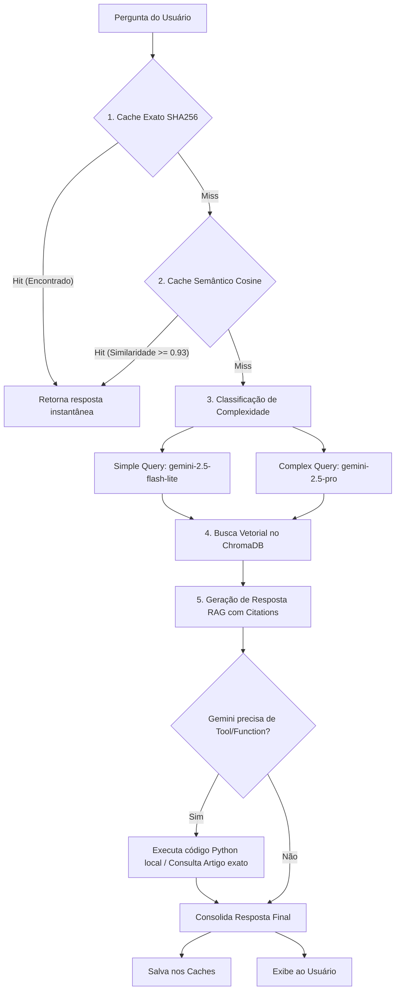

# Guia de Estudos — Projeto Assistente Jurídico RAG

Este documento consolida as explicações sobre o funcionamento, arquitetura, testes, deploy e modelagem de negócios do projeto **Assistente Jurídico RAG** (`gov-legal-assistant-rag`).

---

## 🏛️ 1. O Problema e a Abordagem de Solução

### Qual problema escolhemos resolver?
**Insegurança jurídica, morosidade e risco de descumprimento legal na interpretação de normativas complexas (como LGPD e Nova Lei de Licitações) na Administração Pública.**

* **Para Quem:** Servidores públicos, agentes de contratação, ouvidorias e assessores jurídicos.
* **Contexto de Dificuldade:** Servidores precisam consultar constantemente milhares de páginas de leis e guias oficiais para tomar decisões cotidianas (ex: saber se um edital está de acordo com a LGPD ou se um valor permite contratação direta sem licitação). Pesquisar manualmente consome muito tempo e gera o risco de falhas de interpretação, o que pode paralisar obras públicas ou violar a privacidade de dados.

### Por que abordagens tradicionais falham?
* **Busca Simples (Ctrl+F):** Falha porque exige que o servidor saiba a palavra-chave exata escrita na lei. Se ele buscar por *"limite de dinheiro para dispensa de obra"*, uma busca simples pode não encontrar o Art. 75 da Lei 14.133, que menciona *"dispensa de licitação por valor para obras e serviços de engenharia"*.
* **LLM Puro (sem RAG):** Falha porque modelos de linguagem sofrem com **alucinação**. No Direito Público, a IA inventar uma regra, confundir o valor de um limite, ou citar um artigo de lei inexistente é inaceitável e perigoso.

### Como Resolvemos (LLM + RAG + Tool-use)?
Resolvemos o problema integrando três pilares tecnológicos:
1. **RAG (Retrieval-Augmented Generation):**
   Indexamos os PDFs oficiais das leis e guias (Senado e CGU) em um banco de dados vetorial (**ChromaDB**). Em vez de o Gemini inventar a resposta, o sistema busca os trechos reais da lei relevantes à pergunta e os injeta no prompt do modelo. O Gemini atua apenas como um redator técnico que organiza o texto e **obrigatoriamente cita a fonte** (ex: `[LGPD-2023-ANPD.pdf:p22]`).
2. **Tool-Use (Function Calling) para Precisão:**
   Modelos de linguagem são péssimos em matemática e lógica exata. Resolvemos isso criando **ferramentas Python customizadas** (ex: `simular_enquadramento`). Se o usuário perguntar se um valor de R$ 60.000 é elegível para dispensa, o Gemini aciona a nossa ferramenta, que calcula as regras do Art. 75 de forma determinística em Python e devolve a resposta com precisão matemática absoluta.
3. **Otimização de Custos e Latência (Cache & Routing):**
   Integramos caches que respondem perguntas repetidas sem gastar tokens da API, e um classificador local que envia perguntas fáceis para o modelo barato (`gemini-2.5-flash-lite`) e perguntas complexas para o modelo premium (`gemini-2.5-pro`), gerando economia superior a 50%.

---

## ⚙️ 2. Como Testar o Projeto

### A. Testes Automatizados (Pytest)
Para rodar a suite de testes unitários que valida a indexação, busca (`retrieve`) e respostas (`answer`), execute no terminal da pasta do projeto:
```bash
uv run pytest
```
*Isso deve retornar a validação de que todos os testes passaram (geralmente em torno de 10 segundos): `3 passed, 2 warnings`.*

### B. Interface Visual (Streamlit)
O servidor Streamlit roda localmente. Para iniciá-lo:
```bash
uv run streamlit run src/ui/streamlit_app.py --server.port 8501
```
1. Acesse no seu navegador: [http://localhost:8501/](http://localhost:8501/)
2. Digite perguntas de teste:
   * **LGPD:** *"Qual o prazo de resposta da LGPD?"* (Deve responder 15 dias citando os PDFs da ANPD/LGPD).
   * **Licitações:** *"Como funciona a dispensa de licitação por valor?"* (Deve acionar a ferramenta customizada de simulação).
3. Pergunte a mesma coisa duas vezes seguidas para ver as métricas de **Exact Cache** ou **Semantic Cache** subirem na barra lateral e o balão de `Cache hit` aparecer no topo.

---

## 🔍 3. O que Pode Ser Perguntado ao Assistente?

A base de dados oficial e as ferramentas customizadas cobrem três domínios principais:

1. **LGPD (Lei Geral de Proteção de Dados — Lei 13.709)**
   * *Exemplo:* *"Quais são as bases legais para o tratamento de dados pessoais pelo poder público?"*
   * *Exemplo:* *"O que a LGPD diz sobre o papel do encarregado de dados (DPO)?"*
2. **Licitações e Contratos (Nova Lei de Licitações — Lei 14.133/2021)**
   * *Exemplo:* *"Quais são as modalidades de licitação previstas na nova lei?"*
   * *Exemplo:* *"Quais são os limites atuais para dispensa de licitação por valor?"* (Aciona a simulação automática).
3. **Transparência Pública (Guia de Transparência Ativa — GTA 7ª Edição)**
   * *Exemplo:* *"Quais informações de licitações devem constar obrigatoriamente no portal de transparência?"*
   * *Exemplo:* *"Como funciona a transparência ativa para a remuneração de servidores?"* (Aciona o gerador dinâmico de links para o Portal de Transparência).

---

## 🏗️ 4. Fluxo de Execução Detalhado (Arquitetura)



### Detalhamento dos Passos:
1. **Exact Cache:** Gera um hash SHA256 da pergunta. Se idêntica a alguma anterior, retorna a resposta imediatamente.
2. **Semantic Cache:** Transforma a pergunta em vetor e calcula a similaridade de cosseno com as anteriores. Se a semelhança for `>= 0.93`, aproveita a resposta economizando API.
3. **Classificação (Routing):** Heurísticas locais definem se a pergunta exige raciocínio complexo. Se sim, envia para o Gemini Pro; se não, envia para o Gemini Flash-Lite.
4. **ChromaDB (Retrieval):** Busca os 5 chunks mais próximos semânticos e filtra opcionalmente pelo metadado de domínio.
5. **Prompt Management:** Um prompt blindado contra injeções é montado dinamicamente incluindo o contexto do ChromaDB e a pergunta higienizada.
6. **Function Calling:** O LLM opta por chamar uma de nossas ferramentas programáticas (`tools.py`) se houver cálculos ou buscas específicas a fazer. O resultado alimenta o contexto final.

---

## 🚀 5. Como Publicar o Projeto no Ar (Deploy)

Para fazer o deploy gratuito e seguro utilizando o **Streamlit Community Cloud**:

1. **Subir para o GitHub:** Certifique-se de realizar o push do seu código (incluindo a pasta `data/corpus` com os PDFs e o `requirements.txt`). O `.env` estará automaticamente bloqueado pelo `.gitignore`.
2. **Gerar dependências:** Crie a lista de dependências rodando `uv pip compile pyproject.toml -o requirements.txt` e comite o arquivo gerado.
3. **Fazer Deploy:** No painel do [share.streamlit.io](https://share.streamlit.io/), aponte para o repositório, branch, e defina o arquivo principal como `src/ui/streamlit_app.py`.
4. **Configurar as Secrets:** Nas configurações avançadas do app no Streamlit Cloud, defina as variáveis de ambiente sem expô-las no repositório:
   ```toml
   GEMINI_API_KEY = "AIzaSy..."
   LLM_MODEL = "gemini-2.5-flash-lite"
   EMBED_MODEL = "gemini-embedding-001"
   ```

---

## 💼 6. Uso no Serviço Público e Compliance

* **Co-piloto do Servidor:** A IA serve para gerar minutas e pesquisas ágeis, mas a decisão final é **sempre humana** (*Human-in-the-loop*).
* **Conformidade com a LGPD:** O tratamento de dados públicos pode usar nuvens comerciais. Se o órgão for lidar com dados internos sigilosos de cidadãos, deve-se fechar contratos de nuvem corporativa privada (onde os dados não treinam o modelo) ou hospedar modelos Open Source localmente.
* **Auditabilidade:** Logs estruturados e de rastreabilidade (com `trace_id`) devem ser mantidos para garantir conformidade e fiscalização de uso.

---

## 🐳 7. Encapsulamento com Docker (Ambientes de Testes Reais)

Para rodar a aplicação em servidores dedicados, ambientes internos do órgão ou pipelines de homologação de forma totalmente isolada e protegida, criamos as configurações do **Docker**.

### A. Como Construir a Imagem Docker
No diretório do projeto (onde está o `Dockerfile`), execute o comando para compilar a imagem:
```bash
docker build -t assistente-juridico-rag .
```

### B. Como Executar o Container com Segurança
Em produção ou testes reais, as chaves de API não devem ser salvas na imagem. Nós as passamos como variáveis de ambiente no comando `docker run`.

Execute o comando abaixo passando a sua chave do Gemini:
```bash
docker run -d -p 8501:8501 --name assistente-rag -e GEMINI_API_KEY="SUA_API_KEY_AQUI" assistente-juridico-rag
```
* **`-d`**: Roda o container em segundo plano (detached mode).
* **`-p 8501:8501`**: Mapeia a porta do container para a porta da máquina host.
* **`-e GEMINI_API_KEY="..."`**: Injeta a chave de API de forma segura.

### C. Verificar o Status e Logs
* **Ver logs de auditoria no container:**
  ```bash
  docker logs -f assistente-rag
  ```
* **Parar a execução:**
  ```bash
  docker stop assistente-rag
  ```

