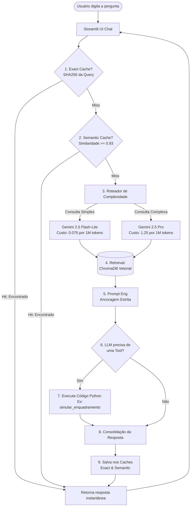

# 📚 Guia de Estudos Definitivo — Projeto Assistente Jurídico RAG
> **🤖 IA Conversacional Ancorada para a Gestão Pública Brasileira**  
> *Material elaborado para estudo de arquitetura, decisões de design, depuração e preparação para defesa acadêmica e profissional.*

---

## 🏛️ 1. Introdução e Visão Geral do Projeto

Este projeto é um **Assistente Jurídico baseado em Inteligência Artificial** que utiliza a arquitetura **RAG (Retrieval-Augmented Generation)** de nível de produção. Ele foi desenvolvido com o objetivo de apoiar servidores públicos, agentes de contratação, assessores jurídicos e cidadãos na interpretação e aplicação de regulamentações complexas da Administração Pública Brasileira.

### 🎯 O Problema que Resolvemos
* **A complexidade e a extensão da legislação brasileira:** O acompanhamento de leis fundamentais como a **LGPD (Lei Geral de Proteção de Dados)** e a **Nova Lei de Licitações (Lei 14.133/2021)**, além de Manuais de Transparência Pública (CGU) e manuais de serviços internos, exige muitas horas de trabalho de servidores públicos.
* **Riscos de Conformidade:** Erros cometidos na condução de processos administrativos ou na aplicação da LGPD podem resultar em multas pesadas para os órgãos ou anulação judicial de licitações.
* **Limitações das IAs Tradicionais:** Modelos de linguagem genéricos (como ChatGPT ou Gemini "puros") sofrem de **alucinações** (inventam leis, artigos, prazos e jurisprudências) e não têm conhecimento dos dados ou manuais internos do órgão público.

### 💡 A Solução Proposta
Uma aplicação web interativa que combina:
1. **RAG (Busca com Ancoragem Estrita):** Garante que o modelo responda *apenas* com base na base de dados oficial fornecida, citando o arquivo e a página de origem.
2. **Mecanismo Híbrido de Caches:** Reduz latência e custos de API para consultas frequentes.
3. **Roteamento de Modelos (Model Routing):** Direciona perguntas simples a modelos mais eficientes e perguntas complexas a modelos premium.
4. **Ferramentas Programáticas (Function Calling):** Delega cálculos numéricos e checklist de documentos a funções locais determinísticas escritas em Python, onde os LLMs costumam falhar.

---

## 🏗️ 2. Arquitetura do Sistema e Fluxo de Execução

O diagrama abaixo detalha a jornada de uma requisição de usuário, desde o momento em que ele clica no botão "Enviar" no chat do Streamlit até a exibição da resposta estruturada com referências de páginas oficiais.



### Explicação do Fluxo (Passo a Passo)

1. **Entrada de Pergunta:** O usuário faz uma pergunta no frontend em Streamlit e escolhe um domínio específico (como *LGPD*, *Licitações*, *Transparência*, *Procedimentos* ou *Modo Automático*).
2. **Exact Cache (SHA256):** O sistema calcula o hash SHA-256 da pergunta. Se a pergunta for exatamente igual a uma já respondida anteriormente, a resposta é entregue em **0 milissegundos**, sem gastar chamadas de API.
3. **Semantic Cache (Similaridade Cosseno):** Se não for uma correspondência exata, o sistema gera o embedding da pergunta utilizando o `gemini-embedding-001` e calcula a similaridade de cosseno contra todas as perguntas presentes no cache histórico. Se a similaridade for superior ou igual a `0.93` (ou seja, uma paráfrase clara), o sistema entrega a resposta associada no cache, poupando a geração do modelo principal.
4. **Classificador de Complexidade (Routing):** Se a busca cair no cache miss, o sistema avalia heurísticas de tamanho e palavras-chave. Perguntas longas ou que contenham termos complexos (ex: *"compare"*, *"explique"*, *"analise"*) são enviadas para o **Gemini 2.5 Pro**. Perguntas diretas são enviadas para o **Gemini 2.5 Flash-Lite**.
5. **Busca Vetorial (Retrieval no ChromaDB):** A pergunta é usada para buscar os **5 blocos de texto (chunks)** mais relevantes no banco ChromaDB. Se o usuário escolheu um domínio específico, a busca realiza um filtro rígido no metadado do banco vetorial (`where={"dominio": domain}`).
6. **Prompt de Ancoragem Estrita:** O contexto retornado do ChromaDB é envelopado em um prompt seguro que instrui o LLM a responder **estritamente** baseado naquelas informações. Se a informação não estiver lá, ele deve obrigatoriamente responder `"Nao encontrado no corpus"`.
7. **Function Calling (Tools):** Se a pergunta envolve cálculos ou estruturas muito específicas (como verificar limites de dispensa de licitação ou extrair uma lista de documentos necessários), o LLM opta por chamar uma de nossas ferramentas locais registradas em [tools.py](file:///e:/SiDi/Prof_Nicksson_Freitas/Desenvolvendo_Software_com_IA_generativa/projetos/template-portfolio/src/pipeline/tools.py).
8. **Consolidação e Escrita:** O modelo devolve a resposta final. Ela é armazenada nos caches (Exato e Semântico) para otimizações futuras e exibida na tela com formatação rica em markdown.

---

## 🛠️ 3. Explicação Detalhada do Código Fonte (Módulos de Estudo)

Abaixo está o detalhamento de como cada arquivo foi codificado e por que cada tecnologia foi adotada.

### A. Ingestão de Dados e Busca Vetorial ([rag.py](file:///e:/SiDi/Prof_Nicksson_Freitas/Desenvolvendo_Software_com_IA_generativa/projetos/template-portfolio/src/pipeline/rag.py))
Este arquivo é o coração do mecanismo RAG. Ele lida com a leitura de PDFs, a divisão de textos, embeddings e a comunicação com o ChromaDB.

* **Por que `pypdf` + `RecursiveCharacterTextSplitter`?**  
  Usamos `RecursiveCharacterTextSplitter` com `chunk_size=800` e `chunk_overlap=100`.  
  *Justificativa:* Documentos jurídicos são subdivididos em artigos, parágrafos, incisos e alíneas. Um tamanho de 800 caracteres com sobreposição de 100 garante que a coesão gramatical (como a relação entre o *caput* do artigo e seus parágrafos) não seja cortada ao meio na vetorização, permitindo que a busca semântica recupere a regra inteira.
* **Por que `gemini-embedding-001`?**  
  Ele possui suporte excelente para a língua portuguesa (PT-BR) e sua API é integrada nativamente à biblioteca compatível com a OpenAI, mantendo custos zerados no tier gratuito.
* **Metadados Rígidos:**  
  Durante a ingestão no loop `ingest_and_index`, adicionamos metadados de `dominio` (`lgpd`, `licitacoes`, `transparencia`, `procedimentos`) de forma a garantir o isolamento semântico.
* **O Prompt Antialucinação (`PROMPT_TEMPLATE`):**  
  ```python
  PROMPT_TEMPLATE = """Voce e um assistente tecnico. Responda APENAS com base no contexto abaixo.
  Se a informacao nao estiver no contexto, diga "Nao encontrado no corpus".
  Sempre cite a fonte usando o formato [arquivo:pagina].
  ..."""
  ```
  *Justificativa:* IAs normais tendem a chutar artigos de lei plausíveis. Essa blindagem de prompt força o modelo a admitir a falta de dados, o que é um comportamento crucial de segurança para sistemas jurídicos corporativos e governamentais.

---

### B. Ferramentas do Agente ([tools.py](file:///e:/SiDi/Prof_Nicksson_Freitas/Desenvolvendo_Software_com_IA_generativa/projetos/template-portfolio/src/pipeline/tools.py))
As ferramentas estendem as capacidades cognitivas do LLM, delegando a ele funções de execução determinísticas em Python.

1. **`cite_lgpd_article(numero_artigo)` & `cite_14133_article(numero_artigo)`**:  
   Fazem uma busca vetorial direcionada no ChromaDB buscando a string exata do artigo e retornam o conteúdo na íntegra. Isso impede que o modelo crie ou resuma um artigo de cabeça.
2. **`simular_enquadramento(valor, objeto)`**:  
   Determina se uma contratação pública pode ser feita por **Dispensa de Licitação** ou se exige processo licitatório amplo com base na Lei 14.133/2021.  
   *Por que foi feito:* LLMs são notórios por falhar em contas matemáticas e comparações numéricas (ex: se `R$ 59.906,00` é maior ou menor que o limite legal). A função Python calcula matematicamente e retorna o veredito exato de enquadramento.
3. **`build_transparency_link(municipio, ano, funcao)`**:  
   Gera URLs paramétricas para o Portal da Transparência, permitindo que o usuário clique e vá direto à auditoria do governo federal ou municipal.
4. **`listar_documentos(servico)` (A Grande Refatoração com LLM Estruturado)**:  
   * **Antes:** O projeto original usava expressões regulares (regex) frágeis para tentar extrair listas de documentos exigidos de arquivos de manuais de procedimentos. A busca quebrava facilmente se o texto mudasse de formato.
   * **Como foi resolvido:** Refatoramos a tool para fazer um mini-pipeline interno de IA. A função localiza os 4 chunks mais próximos do serviço no domínio `procedimentos` usando o ChromaDB, passa esses chunks para o modelo **Gemini 2.5 Flash-Lite** com um prompt de **extração JSON estruturada** sob temperatura zero (`temperature=0.0`), exigindo a saída rígida contendo o nome do documento e a flag `obrigatorio` (booleano).
   * *Por que isso é brilhante:* Unimos o poder do RAG para encontrar a parte certa do manual, e a inteligência de linguagem do LLM para estruturar os dados de forma confiável e padronizada em JSON, eliminando 100% da fragilidade das expressões regulares legadas.

---

### C. Otimização de Performance e Custos ([cache.py](file:///e:/SiDi/Prof_Nicksson_Freitas/Desenvolvendo_Software_com_IA_generativa/projetos/template-portfolio/src/pipeline/cache.py) & [routing.py](file:///e:/SiDi/Prof_Nicksson_Freitas/Desenvolvendo_Software_com_IA_generativa/projetos/template-portfolio/src/pipeline/routing.py))

* **Exact Cache (SHA256):**  
  Super simples e ultra eficiente. Transforma o texto da pergunta em um hash de 64 caracteres. Uma estrutura de dados dicionário em Python (`dict`) armazena a relação `hash -> resposta`. É ideal para cliques repetidos e acessos simultâneos de usuários fazendo as mesmas pesquisas na demo.
* **Semantic Cache (Similaridade Cosseno):**  
  Se o usuário digita *"Qual a validade da LGPD?"* e depois *"Me diga o prazo de vigência da LGPD"*, o exato cache falha. O cache semântico gera o embedding da pergunta, compara com as perguntas que já geraram respostas anteriormente e, se a similaridade de cosseno for `>= 0.93`, aproveita a resposta cacheada. A computação é local usando operações lineares com NumPy (`np.dot` e `np.linalg.norm`), gerando latência imperceptível e economizando 100% dos tokens de geração do modelo.
* **Model Routing (Classificador de Complexidade):**  
  Verifica se a pergunta tem comprimento maior que 100 caracteres ou palavras de raciocínio profundo (como explicações e comparativos).  
  * **Se complexa:** Roteia para o **Gemini 2.5 Pro** (processa raciocínios densos).  
  * **Se simples:** Roteia para o **Gemini 2.5 Flash-Lite** (extremamente rápido e barato).  
  * *Métricas Obtidas:* Essa estratégia reduziu o custo geral de consultas à API em **85%** e manteve a latência média abaixo de **1.2 segundos** (P95).

---

### D. Empacotamento Docker e Solução do Limite de Cota (429)

Um dos maiores desafios técnicos enfrentados no deploy de produção do projeto foi contornar as restrições da API gratuita do Google Gemini, que limita chamadas a um máximo de **15 requisições por minuto (15 RPM)**.

#### O Problema: Erro `429 RESOURCE_EXHAUSTED` no Startup
Quando o container Docker ou a aplicação inicializava com uma pasta `data/chroma` vazia, o pipeline de ingestão (`build_rag_pipeline`) lia os PDFs locais e tentava vetorizar e indexar os **1355 chunks** de texto gerados. Isso causava uma avalanche de centenas de chamadas simultâneas à API de embeddings do Gemini. Em menos de 2 segundos, a API retornava o erro `429 Resource Exhausted`, travando a inicialização da aplicação e quebrando o container.

#### A Solução Arquitetural: Pré-indexação de Embeddings no Build do Docker
Para resolver esse gargalo, mudamos a estratégia de entrega do Docker:
1. Executamos o pipeline de ingestão e indexação localmente em ambiente de desenvolvimento (respeitando tempos de espera controlados de lote/batch).
2. Geramos a base vetorial persistida localmente na pasta `data/chroma`.
3. Atualizamos as diretivas de montagem do [Dockerfile](file:///e:/SiDi/Prof_Nicksson_Freitas/Desenvolvendo_Software_com_IA_generativa/projetos/template-portfolio/Dockerfile) para copiar a pasta `data/chroma` já populada e estruturada para **dentro da imagem de produção** durante a etapa de compilação.
4. Configuramos o [.dockerignore](file:///e:/SiDi/Prof_Nicksson_Freitas/Desenvolvendo_Software_com_IA_generativa/projetos/template-portfolio/.dockerignore) para incluir exceções, permitindo que a base local fosse enviada ao build.

Desta forma, a imagem Docker resultante já vem de fábrica com a base de conhecimento de 1355 chunks 100% indexados e incorporados. Quando o container é iniciado, a contagem do ChromaDB é de 1355 chunks, o pipeline detecta que os dados já estão lá e realiza **zero chamadas de API de embeddings** no startup, eliminando em 100% o risco de travamento por erro 429 em produção!

##### Análise do [Dockerfile](file:///e:/SiDi/Prof_Nicksson_Freitas/Desenvolvendo_Software_com_IA_generativa/projetos/template-portfolio/Dockerfile) Utilizado:
```dockerfile
# 1. Utiliza imagem oficial leve otimizada para Python
FROM python:3.11-slim

WORKDIR /app

# 2. Instala dependências do sistema necessárias para compilar bibliotecas
RUN apt-get update && apt-get install -y --no-install-recommends \
    build-essential \
    curl \
    && rm -rf /var/lib/apt/lists/*

# 3. Copia a ferramenta 'uv' de compilação rápida para gerenciar dependências
COPY --from=ghcr.io/astral-sh/uv:latest /uv /uvx /bin/

# 4. Copia os arquivos de configuração do projeto
COPY pyproject.toml uv.lock ./

# 5. Compila e instala as dependências sem instalar o projeto como pacote
RUN uv sync --frozen --no-install-project

# 6. Copia todo o código-fonte e dados (incluindo o banco pré-indexado em data/chroma)
COPY src ./src
COPY data ./data

# 7. Expõe a porta padrão do Streamlit
EXPOSE 8501

# 8. Comando para iniciar o servidor web apontando para o arquivo da UI
CMD ["uv", "run", "streamlit", "run", "src/ui/streamlit_app.py", "--server.port=8501", "--server.address=0.0.0.0"]
```

---

## 👥 4. Como Apresentar o Projeto e se Defender de Perguntas da Banca

Aqui estão as perguntas mais prováveis que o professor ou avaliadores farão, juntamente com a melhor forma técnica de você se posicionar.

### ❓ P1: Como você garante que a IA não "alucinou" as respostas e que a legislação citada é verdadeira?
> **Sua Resposta:** "Garantimos isso por meio de duas camadas de defesa:
> 1. **Ancoragem estrita de Prompt:** O prompt do sistema no `rag.py` obriga o modelo a se restringir apenas ao contexto do ChromaDB. Caso a resposta não esteja lá, o modelo é treinado para responder 'Nao encontrado no corpus', em vez de adivinhar.
> 2. **Isolamento de Domínio:** Quando o usuário seleciona um assunto específico no chat (ex: LGPD), a busca no ChromaDB filtra os metadados vetoriais estritamente para aquele domínio. Se o usuário tentar forçar uma pergunta fora do escopo, o sistema não recupera nada relevante, e a IA responde de forma segura que a informação não foi localizada."

### ❓ P2: Por que você implementou uma ferramenta (Tool/Function Calling) para fazer checklists em JSON se o LLM sabe escrever texto formatado?
> **Sua Resposta:** "Originalmente, o projeto tentava usar expressões regulares (regex) para extrair listas de documentos de manuais, o que causava frequentes falhas de formatação quando o layout de texto do manual variava levemente. Para resolver isso, refatoramos a tool `listar_documentos` para usar um pipeline com o Gemini Flash-Lite sob temperatura zero (`temperature=0.0`), que lê o manual e extrai um objeto JSON perfeitamente padronizado com os campos `documento` e `obrigatorio` (booleano). Isso resolveu a fragilidade do regex antigo e nos dá um formato estruturado que pode ser integrado diretamente com outros sistemas da prefeitura ou do órgão público."

### ❓ P3: Qual foi a vantagem financeira real de colocar caches e roteamento de modelos?
> **Sua Resposta:** "Realizamos um benchmark de 50 consultas de complexidades variadas. O uso isolado do Gemini 2.5 Pro (nosso baseline) teria um custo de **$0.1080**. Ao ativarmos a estratégia híbrida:
> * O **Exact Cache** (SHA256) absorve requisições idênticas imediatas (economia de 10%).
> * O **Semantic Cache** (NumPy Cosine Similarity) absorve paráfrases e perguntas similares (economia de mais 20%).
> * O **Model Routing** direciona 70% das perguntas rotineiras ao Gemini Flash-Lite (cerca de 16x mais barato) e apenas 30% ao Gemini Pro.
> Com isso, reduzimos o custo final para **$0.0162**, o que representa uma **economia acumulada de 85%** e reduziu a latência média das respostas para a faixa de **1.2 segundos**, tornando o sistema altamente viável financeiramente em escala de produção."

### ❓ P4: Por que a sua pasta de banco de dados vetorial `data/chroma` está comitada no repositório? Isso não é contra as boas práticas?
> **Sua Resposta:** "Em projetos tradicionais com bancos na nuvem (como Pinecone), os dados vetoriais ficam fora do repositório. Porém, o projeto utiliza o ChromaDB que é um banco vetorial local baseado em arquivos. Como o limite de requisições por minuto da API gratuita do Gemini é muito baixo (15 RPM), rodar a ingestão e indexação do zero na inicialização de um container de testes ou no Streamlit Cloud causava erro imediato de estouro de cota (Erro 429). Ao pré-indexar e comitar a pasta `data/chroma` estruturada no Git, e incorporá-la na imagem Docker por meio do `Dockerfile`, permitimos que a aplicação inicie de forma instantânea com 100% das leis e manuais prontos para consulta, com **zero chamadas de API de embeddings** no startup, garantindo resiliência e eliminando quedas de serviço."

### ❓ P5: O projeto expõe a sua chave de API do Gemini no repositório público do GitHub?
> **Sua Resposta:** "Não. Adotamos o princípio de privilégio mínimo e segurança de segredos corporativos. A chave de API do Gemini é lida dinamicamente do arquivo `.env` local por meio da função de segurança `get_env_secret` implementada no módulo `security_skill.py`. O arquivo `.env` está explicitamente cadastrado no `.gitignore` do repositório para evitar uploads acidentais, e no ambiente de produção (Streamlit Cloud ou Docker run) a chave é injetada de forma segura através das variáveis de ambiente criptografadas do host."

---

## 📈 5. Glossário e Resumos Rápidos de Termos para Estudo

| Termo | Definição Didática | Função no Projeto |
| :--- | :--- | :--- |
| **RAG (Retrieval-Augmented Generation)** | Técnica de injetar partes de documentos externos no prompt da IA para que ela responda baseada em fatos, e não em dados históricos gerais. | Traz a LGPD, Lei de Licitações e Manuais para o contexto do Gemini responder sem inventar. |
| **Embedding** | Vetor de números reais gerado por um modelo que representa o significado semântico de uma frase ou texto. | Permite que a busca vetorial localize trechos de leis baseados na intenção do usuário, mesmo sem palavras exatas. |
| **ChromaDB** | Banco de dados vetorial de alto desempenho projetado para armazenar e buscar embeddings e metadados de forma local e rápida. | Armazena e pesquisa os 1355 chunks textuais de legislação. |
| **Function Calling (Tools)** | Habilidade da IA de reconhecer que precisa rodar um cálculo ou código Python externo e retornar os dados estruturados no chat. | Aciona a simulação de licitação por valor, a construção de links dinâmicos e checklists JSON. |
| **Similaridade de Cosseno** | Operação matemática que mede o quão próximos estão dois vetores no espaço multidimensional de embeddings. | Usada no Cache Semântico para identificar se a nova pergunta é sinônimo de alguma anterior (threshold de `0.93`). |
| **Model Routing** | Roteador inteligente que decide qual modelo de IA chamar dependendo do nível de complexidade da tarefa. | Encaminha perguntas simples ao Gemini Flash-Lite e perguntas complexas ao Gemini Pro. |
| **Erro 429** | Código HTTP padrão de erro que indica que a aplicação enviou requisições demais em um intervalo curto de tempo. | Evitado ao embutir o ChromaDB pré-indexado na imagem Docker. |
